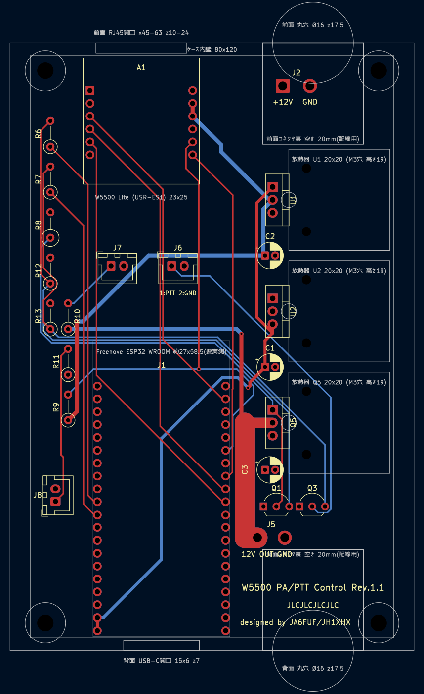

# Shonan_Lite-androidPhone

Pluto直結DVB-S2トランシーバー「Shonan」のAndroidスマートフォン版(`android/`)。タブレット版
[Shonan_Lite-android](https://github.com/kazushinjo/Shonan_Lite-android)を元に、狭い画面幅に合わせて
画面上部のタブで機能を切り替える単一画面構成にしている。詳細な構成・アーキテクチャは
[`android/README.md`](android/README.md)を参照。

Android smartphone version of "Shonan", a DVB-S2 transceiver directly connected to a Pluto (`android/`).
Based on the tablet version [Shonan_Lite-android](https://github.com/kazushinjo/Shonan_Lite-android), it uses a
single screen whose functions are switched with tabs at the top, to fit a narrow phone screen. See
[`android/README.md`](android/README.md) for the detailed architecture and implementation.

## 主な機能

- **画面構成**: 上部のタブ(送信・受信・周波数・シンボルレート・誤り訂正・変調方式・映像ソース・配信先・
  受信感度・送信出力・設定・ヘルプ)で切り替える。上部バーに「アプリ再起動」「終了」。
  タブレット版にあるRSSI測定・機器試験は搭載していない。
- **送信**: 周波数・シンボルレート(250k〜2 Msym/s)・誤り訂正(1/2・3/5・8/9)・変調方式(QPSK・8PSK)・
  出力減衰量(-70〜0 dB)を設定し、UDP-TSでPlutoへ送ってPluto内蔵の変調器で送信する(送信先ポートは8282固定)。
  送信映像はHD(1280x720)・30fps。
- **映像ソース**: 背面カメラ(既定)・前面カメラ・写真(写真フォルダーから選択)・テストパターン。
  写真にはコールサイン・備考を焼き込める。マイク音声の送信ON/OFF。
- **受信**: 外部復調機器からのUDP-TS受信(既定)、またはオンデバイス復調(GNU Radio、Pluto 1台でのRFループバック
  試験にも使える)。ロックすると映像を全画面表示し、タップで5秒間だけ状態を表示する。
- **その他**: Plutoの自動検出(端末の接続中ネットワークを探索し、見つからなければESP32ブリッジに問い合わせ。
  起動時にも1回実行)、起動時のPluto再起動、日本語/英語表示、アプリ内ヘルプ。

★アプリID(パッケージ名)`com.shinjo.shonanandroid`はタブレット版と同じ。同じ端末に両方を並べて
インストールすることはできない(後から入れた方が前の方を上書きしようとし、署名が異なるとインストールに失敗する)。

## インストール

### 前提条件

- macOS + [Android Studio](https://developer.android.com/studio)(Android SDKが同梱されます)
- Android Studio の SDK Manager > SDK Tools から **NDK (Side by side) 27.3.13750724** をインストール
- Android端末(minSdk 26以上、arm64-v8a)。端末の開発者向けオプションでUSBデバッグを有効化

### 未クローンのマシンで初めて使う場合

このリポジトリはPrivateなので匿名の`curl | bash`は使えない。`gh auth login`済みの
マシンであれば、`bootstrap.sh`だけ先に取得してから実行することでclone不要で始められる:

```sh
gh api repos/kazushinjo/Shonan_Lite-androidPhone/contents/bootstrap.sh \
  --jq '.content' | base64 -d > bootstrap.sh
chmod +x bootstrap.sh
./bootstrap.sh                       # $HOME/Shonan_Lite-androidPhone へclone
./bootstrap.sh ~/path/to/dir         # clone先を指定する場合
./bootstrap.sh ~/path/to/dir --build-only  # install.shへの追加引数も渡せる
```

git-lfsが未インストールなら自動で`brew install git-lfs`を試みる。既に`~/Shonan_Lite-androidPhone`
等にcloneが存在する場合は`git pull --ff-only`で更新してから続行する。

### 既にクローン済みの場合の手順

```sh
./install.sh
```

- Android SDK/NDKの検出、`android/local.properties`の自動生成、`assembleDebug`ビルド、接続中の端末への`adb install`までを自動で行う
- 端末が1台も接続されていない場合は、生成されたAPK(`android/app/build/outputs/apk/debug/app-debug.apk`)を手動で端末へ転送してインストールしてください
- 複数端末が接続されている場合は、対象を指定した`adb install`コマンド例を表示するので、それに従ってください

### オプション

```sh
./install.sh --build-only   # ビルドのみ行い、adb installはしない
./install.sh --clean        # ビルド前に ./gradlew clean を実行する
./install.sh --release      # assembleReleaseでビルド
```

`--release`は、`android/keystore/keystore.properties`(と鍵ファイル。Git管理外)があれば署名して端末へインストール
まで行います。無い場合は未署名APKになり、そのままでは端末にインストールできません。

### Android Studioなしでビルドする場合(一般ユーザー向け)

Android Studioをインストールしていない場合でも、`cli-install.sh`を使えばコマンドラインのみで
ソースコードからビルド・インストールできます。Android SDK Command-line Toolsの取得、
必要なplatform/NDKのセットアップまで自動で行い、最後に`install.sh`へ処理を引き継ぎます。

```sh
brew install openjdk@17   # Javaが未インストールの場合のみ
./cli-install.sh
```

`install.sh`と同じオプション(`--build-only`、`--clean`、`--release`)がそのまま渡せます。

```sh
./cli-install.sh --build-only
```

## Installation

### Prerequisites

- macOS + [Android Studio](https://developer.android.com/studio) (bundles the Android SDK)
- Install **NDK (Side by side) 27.3.13750724** from Android Studio's SDK Manager > SDK Tools
- An Android device (minSdk 26+, arm64-v8a). Enable USB debugging under Developer Options

### First use on a machine with no clone yet

This repository is private, so an anonymous `curl | bash` won't work. On a machine
already signed in with `gh auth login`, you can fetch just `bootstrap.sh` first and
run it to get started without cloning by hand:

```sh
gh api repos/kazushinjo/Shonan_Lite-androidPhone/contents/bootstrap.sh \
  --jq '.content' | base64 -d > bootstrap.sh
chmod +x bootstrap.sh
./bootstrap.sh                       # clones to $HOME/Shonan_Lite-androidPhone
./bootstrap.sh ~/path/to/dir         # clone to a specific directory
./bootstrap.sh ~/path/to/dir --build-only  # extra args are passed through to install.sh
```

If git-lfs isn't installed, it automatically tries `brew install git-lfs`. If a clone
already exists (e.g. under `~/Shonan_Lite-androidPhone`), it updates it with `git pull --ff-only`
before continuing.

### Steps if you already have a clone

```sh
./install.sh
```

- Automatically detects the Android SDK/NDK, generates `android/local.properties`, runs an `assembleDebug` build, and runs `adb install` on any connected device
- If no device is connected, manually transfer the built APK (`android/app/build/outputs/apk/debug/app-debug.apk`) to your device and install it
- If multiple devices are connected, it prints an `adb install` command for each device — follow the printed instructions to pick one

### Options

```sh
./install.sh --build-only   # build only, skip adb install
./install.sh --clean        # run ./gradlew clean before building
./install.sh --release      # build with assembleRelease
```

With `--release`, if `android/keystore/keystore.properties` (and the key file, both outside Git) exist, the APK is signed
and installed on the device. Otherwise the APK is unsigned and cannot be installed on a device as is.

### Building without Android Studio (for general users)

If you don't have Android Studio installed, `cli-install.sh` lets you build and install
from source using only the command line. It automatically downloads the Android SDK
Command-line Tools, sets up the required platform/NDK, and then hands off to `install.sh`.

```sh
brew install openjdk@17   # only if Java isn't installed yet
./cli-install.sh
```

It accepts the same options as `install.sh` (`--build-only`, `--clean`, `--release`).

```sh
./cli-install.sh --build-only
```

## オプション: ESP32 W5500(PA_Power/PTTコントローラ) / Option: ESP32 W5500 (PA_Power/PTT controller)

ESP32とW5500(有線LAN)で、PA等の12 V電源とPTTをLAN経由でON/OFFするオプションの制御基板。
使わなくてもShonan_Liteは動作する。
ファームウェアは[`hardware/W5500_PA_PTT_Control/W5500_PA_PTT_Control.ino`](hardware/W5500_PA_PTT_Control/W5500_PA_PTT_Control.ino)、
基板は[`hardware/W5500_PA_PTT_Control/kicad/`](hardware/W5500_PA_PTT_Control/kicad/)(KiCad、Rev.1.0)。基板とファームウェアはShonan_Lite-RasPI5版と共通。

| 基板の3D表示 / 3D view of the board | 基板レイアウト(KiCad) / PCB layout (KiCad) | ケース(OpenSCAD) / Case (OpenSCAD) |
| --- | --- | --- |
|  |  |  |

| 項目<br>Item | 内容<br>Details |
| --- | --- |
| 構成<br>Configuration | Freenove ESP32-WROOM-32E DevKitC(ソケットに差し込み)+W5500 Lite(SPI接続)<br>Freenove ESP32-WROOM-32E DevKitC (plugged into a socket) + W5500 Lite (SPI) |
| 12 V電源<br>12 V power | 2SJ334(Pチャネル MOSFET)のハイサイドスイッチでJ5の12 V出力をON/OFF。放熱器付きで目安は約7 Aまで<br>J5's 12 V output is switched by a 2SJ334 (P-channel MOSFET) high-side switch; with its heatsink, up to about 7 A |
| PTT<br>PTT | 2SC1815で無線機のPTT端子をGNDへ落とす(J6)<br>A 2SC1815 pulls the radio's PTT line to GND (J6) |
| 電源入力<br>Power input | +12 V(13.8 V系)をJ2へ。L7805で5 V(ESP32)、TA48033Sで3.3 V(W5500)を作る<br>+12 V (13.8 V class) to J2; an L7805 makes 5 V (ESP32) and a TA48033S makes 3.3 V (W5500) |
| 表示LED<br>Indicator LEDs | 外付け。J7=12 V出力(赤)、J8=12 V入力(緑)(JST XH)<br>External; J7 = 12 V output (red), J8 = 12 V input (green) (JST XH) |
| ネットワーク<br>Network | 固定IP(初期値`192.168.0.100`)。ブラウザで`http://<IP>/`を開くと手動でON/OFFでき、`http://<IP>/config`でIPや遅延時間を変更できる<br>Static IP (default `192.168.0.100`); open `http://<IP>/` in a browser to switch ON/OFF manually, and `http://<IP>/config` to change the IP and delays |
| 基板<br>Board | 72×115 mm、4層(内層はGNDと+12Vのベタ)、部品はすべてスルーホール。JLCPCBの発注データは[`fabrication/jlcpcb/`](hardware/W5500_PA_PTT_Control/fabrication/jlcpcb/)<br>72×115 mm, 4 layers (inner layers are GND and +12 V planes), all through-hole parts. JLCPCB order data is in [`fabrication/jlcpcb/`](hardware/W5500_PA_PTT_Control/fabrication/jlcpcb/) |
| ケース<br>Case | OpenSCAD(LAN_PTT.scad)、内寸80×120×35 mm。前面にRJ45の角穴と+12V入力の丸型コネクタ、背面にUSBの穴と12 V出力・PTTの丸型コネクタ<br>OpenSCAD (LAN_PTT.scad), inside 80×120×35 mm. RJ45 opening and +12 V input circular connector on the front; USB opening and 12 V output/PTT circular connector on the back |

Shonan_Lite-androidPhoneでの使い方:

- 設定画面の「PA_Power/PTTコントローラ (ESP32)」で「ESP32 W5500を使用する」をONにし、ESP32のIPアドレス(初期値`192.168.0.100`)を入力する。「使用する」の初期値はOFF。
- 送信開始/終了に連動してPTTを(`GET /tx?state=on|off`)、アプリ起動の5秒後に12 V電源(Pluto含む)を(`GET /ch?idx=0&state=on`)自動でONにする。
- 画面上部の「終了」では、PTTと12 V電源をOFFにしてからアプリを終了する。ESP32が応答しなくても送受信・終了はそのまま行う。

詳しくは[仕様書](hardware/W5500_PA_PTT_Control/docs/W5500_PA_PTT_Control_仕様書.md)と
[接続一覧](hardware/W5500_PA_PTT_Control/docs/MCU1_J1_W5500_接続一覧.md)を参照(どちらも日英併記。Word版・PDF版も同じフォルダにある)。
回路図: [`w5500-esp32.pdf`](hardware/W5500_PA_PTT_Control/kicad/w5500-esp32.pdf)、
実装図: [`w5500-esp32_実装図_部品番号.pdf`](hardware/W5500_PA_PTT_Control/fabrication/assembly/w5500-esp32_実装図_部品番号.pdf)。

> [!NOTE]
> ESP32への書き込みと起動は確認済み。12 V電源・PTTの駆動回路と無線機をつないだ実地試験はまだ行っていない。

<!-- English -->

An optional control board that uses an ESP32 and a W5500 (wired LAN) to switch the 12 V power for the PA etc.
and the PTT ON/OFF over the LAN. Shonan_Lite works without it.
The firmware is [`hardware/W5500_PA_PTT_Control/W5500_PA_PTT_Control.ino`](hardware/W5500_PA_PTT_Control/W5500_PA_PTT_Control.ino)
and the board is in [`hardware/W5500_PA_PTT_Control/kicad/`](hardware/W5500_PA_PTT_Control/kicad/) (KiCad, Rev.1.0). The board and firmware are shared with the
Shonan_Lite-RasPI5 edition.

How to use it with Shonan_Lite-androidPhone:

- On the Settings screen, turn on "Use ESP32 W5500" under "PA_Power/PTT Controller (ESP32)" and enter the ESP32's IP address (default `192.168.0.100`). "Use" is off by default.
- PTT follows TX start/stop (`GET /tx?state=on|off`), and the 12 V power (including the Pluto) is turned ON 5 seconds after app start (`GET /ch?idx=0&state=on`).
- "Quit" in the top bar turns PTT and the 12 V power OFF before the app ends. TX/RX and quitting still work if the ESP32 does not respond.

For details, see the [specification](hardware/W5500_PA_PTT_Control/docs/W5500_PA_PTT_Control_仕様書.md) and the
[connection list](hardware/W5500_PA_PTT_Control/docs/MCU1_J1_W5500_接続一覧.md) (both in Japanese and English;
Word and PDF versions are in the same folder).
Schematic: [`w5500-esp32.pdf`](hardware/W5500_PA_PTT_Control/kicad/w5500-esp32.pdf);
assembly drawing: [`w5500-esp32_実装図_部品番号.pdf`](hardware/W5500_PA_PTT_Control/fabrication/assembly/w5500-esp32_実装図_部品番号.pdf).

> [!NOTE]
> Flashing and booting the ESP32 have been confirmed. A field test with the 12 V power/PTT drive circuits
> connected to a radio has not been done yet.

## 免責事項

1. **無保証・自己責任**  
   本ソフトウェアは現状のまま(AS IS)で提供され、動作、品質、特定の目的への適合性を含め、いかなる保証もありません。
   本ソフトウェアの使用または使用できないことによって生じた、機器の破損、データの消失、電波障害、その他一切の損害について、
   開発者は責任を負いません。ご自身の責任においてご利用ください。
2. **免許と法令の順守**  
   本ソフトウェアは、アマチュア無線のDATV(デジタルATV)実験のための送受信ソフトウェアです。電波を送信するには、運用する
   国・地域の法令に基づく免許が必要です(日本国内ではアマチュア局の免許)。周波数、空中線電力、電波の型式、運用できる範囲などの
   法令(日本国内では電波法および関係規則)を守ってください。免許のない送信や、免許の範囲を超えた送信は、法令違反となることが
   あります。本ソフトウェアは、設定された周波数・出力・変調方式が法令に適合していることを確認も保証もしません。
   送信の内容と結果は、すべて使用者の責任です。
3. **機器の取り扱い**  
   PlutoのTXとRXの接続、外部アンプ(PA)・アッテネータ・アンテナの接続、送信出力の設定を誤ると、機器を破損したり、
   他の無線局へ障害を与えたりするおそれがあります。機器の仕様を確認し、使用者の責任で行ってください。
   特に、オンデバイス復調でRFループバック試験を行うときは、TXをRXへ直接接続せず、40 dB以上の減衰器を介してください。
4. **第三者ソフトウェアとライセンス**  
   本ソフトウェアは、FFmpeg、aff3ct、StreamPU、libiio、GNU Radio、gr-dvbs2rx、VOLK、Boost、GMP、spdlog、libxml2、
   AndroidX(Jetpack Compose・CameraX)、SSHJ、Bouncy Castleなどの第三者ソフトウェアを利用・同梱します。
   それぞれのライセンスに従います。本ソフトウェア自体は GNU General Public License v3(またはそれ以降のバージョン)の下で
   提供されます(下記「ライセンス」参照)。
5. **動作について**  
   ご使用の端末・環境によって動作が異なる場合や、未発見の不具合が含まれる可能性があります。

## クレジット

- 受信部の方式考案・受信部原システム設計: 山崎慎慈氏(JE1BTA) — `rpi-dvbs2-receiver-gui`の設計に基づく
- 受信部安定化調査修正・再捕捉修正・本アプリ開発: 真城和一(JA6FUF/JH1XHX)
- 本アプリは、Dave Crump氏(G8GKQ)が開発したDATV送受信機プロジェクト「Portsdown」に啓発され、開発したものです。同氏の先駆的な取り組みに感謝いたします。

## ライセンス

本プログラムはフリーソフトウェアです。GNU General Public License v3(またはそれ以降のバージョン)の下で
再配布・改変することができます。
同梱している第三者ソフトウェアのライセンスは[THIRD_PARTY_NOTICES.md](THIRD_PARTY_NOTICES.md)を参照してください。

```
Copyright (C) 2026  Kazuichi Shinjo
Copyright of `rpi-dvbs2-receiver-gui` is held by Shinji Yamazaki.

This program is free software: you can redistribute it and/or modify
it under the terms of the GNU General Public License as published by
the Free Software Foundation, either version 3 of the License, or
(at your option) any later version.

This program is distributed in the hope that it will be useful,
but WITHOUT ANY WARRANTY; without even the implied warranty of
MERCHANTABILITY or FITNESS FOR A PARTICULAR PURPOSE.  See the
GNU General Public License for more details.

You should have received a copy of the GNU General Public License
along with this program.  If not, see <https://www.gnu.org/licenses/>.
```

ライセンス全文は[LICENSE](LICENSE)を参照してください(<https://www.gnu.org/licenses/gpl-3.0.html>にも掲載されています)。

## Disclaimer

1. **No warranty; use at your own risk**  
   This software is provided "AS IS" without warranty of any kind, including any warranty of operation, quality or fitness for
   a particular purpose. The developers accept no liability for any damage arising from the use of, or inability to use, this
   software, including damage to equipment, loss of data and radio interference. Use it at your own risk.
2. **Licensing and compliance with the law**  
   This software is for amateur-radio DATV (digital ATV) experiments. Transmitting requires a license under the laws of the
   country or region where you operate (in Japan, an amateur station license). Observe the applicable laws on frequency,
   transmitter power, emission type and permitted operation (in Japan, the Radio Act and related regulations). Transmitting
   without a license, or beyond the scope of your license, may violate the law. This software neither checks nor guarantees
   that the configured frequency, power and modulation comply with the law. You are solely responsible for what you transmit
   and for the results.
3. **Handling of equipment**  
   Wrong connections between the Pluto's TX and RX, wrong external amplifier (PA), attenuator or antenna connections, or wrong
   transmit power settings may damage equipment or interfere with other stations. Check the specifications of your equipment
   and do this at your own responsibility. In particular, when running an RF loopback test with on-device demodulation, never
   connect TX directly to RX; use an attenuator of 40 dB or more.
4. **Third-party software and license**  
   This software uses and bundles third-party software such as FFmpeg, aff3ct, StreamPU, libiio, GNU Radio, gr-dvbs2rx, VOLK,
   Boost, GMP, spdlog, libxml2, AndroidX (Jetpack Compose, CameraX), SSHJ and Bouncy Castle, each under its own license.
   This software itself is provided under the GNU General Public License v3 (or any later version); see "License" below.
5. **About behavior**  
   Behavior may differ depending on your device and environment, and undiscovered defects may remain.

## Credits

- Reception method design and original receiver system design: Shinji Yamazaki (JE1BTA) — based on the design of `rpi-dvbs2-receiver-gui`
- Receiver stabilization investigation/fixes, re-acquisition fixes, and app development: Kazuichi Shinjo (JA6FUF/JH1XHX)
- This application was developed inspired by "Portsdown", the DATV transceiver project created by Dave Crump (G8GKQ). We extend our deep gratitude for his pioneering work.

## License

This program is free software: you can redistribute it and/or modify it under the terms of
the GNU General Public License v3 (or any later version).
For the licenses of the bundled third-party software, see [THIRD_PARTY_NOTICES.md](THIRD_PARTY_NOTICES.md).

```
Copyright (C) 2026  Kazuichi Shinjo
Copyright of `rpi-dvbs2-receiver-gui` is held by Shinji Yamazaki.

This program is free software: you can redistribute it and/or modify
it under the terms of the GNU General Public License as published by
the Free Software Foundation, either version 3 of the License, or
(at your option) any later version.

This program is distributed in the hope that it will be useful,
but WITHOUT ANY WARRANTY; without even the implied warranty of
MERCHANTABILITY or FITNESS FOR A PARTICULAR PURPOSE.  See the
GNU General Public License for more details.

You should have received a copy of the GNU General Public License
along with this program.  If not, see <https://www.gnu.org/licenses/>.
```

See [LICENSE](LICENSE) for the full license text (also available at <https://www.gnu.org/licenses/gpl-3.0.html>).
